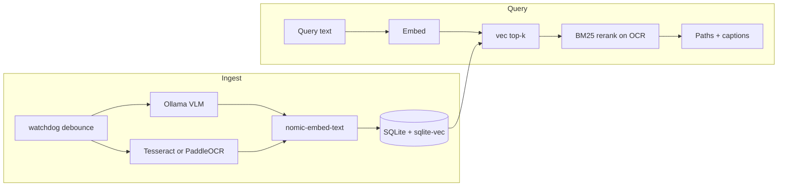

# Ask My Screenshots

Local-first semantic search over your screenshot folder. Type *"that error from last Tuesday"* or *"the pricing slide with the bar chart"* — get the screenshots back.

> **Demo GIF:** Record a 30-second search session and add `docs/demo.gif` here. This is the portfolio money shot.

## Why I built this

macOS Spotlight OCR-indexes text but not meaning. Rewind is closed, paid, and cloud-hosted. CLIP-only tools miss dense UI text. I wanted a **private, local** pipeline that combines **VLM captions**, **OCR**, and **semantic embeddings** so natural-language queries actually work on real screenshots.

## Architecture



| Layer | Tool |
|-------|------|
| VLM | Qwen2-VL / MiniCPM-V via [Ollama](https://ollama.com) |
| OCR | Tesseract (default) or PaddleOCR (optional) |
| Embeddings | `nomic-embed-text` via Ollama |
| Vector store | SQLite + [sqlite-vec](https://github.com/asg017/sqlite-vec) |
| Watcher | `watchdog` with 2s debounce |
| UI | Textual TUI (`screenshot-search tui`) |

## Quick start

### Prerequisites

1. [Ollama](https://ollama.com) running locally
2. Pull models: `ollama pull nomic-embed-text` and a vision model such as `ollama pull llava:7b` (`qwen2-vl:7b` is not published on Ollama; use `llava`, `moondream`, or `qwen2.5vl` instead)
3. Tesseract on `PATH` — Windows: `winget install UB-Mannheim.TesseractOCR` (auto-detected at `C:\Program Files\Tesseract-OCR\`)

### Install

```bash
pip install -e .
# or
pipx install .
```

Optional PaddleOCR (better on dense UI text):

```bash
pip install -e ".[paddle]"
```

### Index & search

```bash
# Copy and edit config
cp config.example.toml config.toml

# Index (Windows default folder: Pictures\Screenshots)
screenshot-search index

# Search (shortcut: bare query runs search)
screenshot-search "that postgres connection error"

# JSON output
screenshot-search search "pricing bar chart" --json

# CPU-only fast mode (skip VLM)
screenshot-search index --ocr-only

# Watch folder (debounced auto-index)
screenshot-search watch

# Interactive TUI
screenshot-search tui
```

### TUI keybinds

| Key | Action |
|-----|--------|
| Enter | Open image in default viewer |
| `y` | Copy path to clipboard |
| `o` | Reveal in file manager (Explorer on Windows) |

## Privacy

Screenshots may contain **passwords, tokens, and DMs**. This tool:

- Stores everything **locally** in a SQLite file (default `%LOCALAPPDATA%\ams\ams.sqlite3` on Windows)
- Supports **`.amsignore`** (gitignore syntax) to skip sensitive paths
- **Redacts** common secret patterns in OCR text before embedding (not a security scanner — review before sharing your DB)

Example `.amsignore`:

```gitignore
private/**
*.env
banking/**
```

## Configuration

See [`config.example.toml`](config.example.toml). Override path with `AMS_CONFIG=/path/to/config.toml`.

## Benchmarks

Run on your screenshot folder (requires Ollama):

```bash
python benchmarks/run_benchmarks.py --folder "%USERPROFILE%\Pictures\Screenshots"
python benchmarks/run_benchmarks.py --folder ./fixtures --ocr-only
```

| Metric | Template (fill after run) |
|--------|---------------------------|
| Index throughput (VLM) | _imgs/min_ |
| Index throughput (OCR-only) | _imgs/min_ |
| Query latency p50 | _ms_ |
| Query latency p95 | _ms_ |
| Disk per 1k images | _MB_ |

See [`benchmarks/results.md`](benchmarks/results.md) for committed numbers.

## Eval methodology

1. Build a **fixture folder** of ~100 screenshots named to match [`tests/eval/queries.jsonl`](tests/eval/queries.jsonl) (or your own labels)
2. Index: `screenshot-search index ./fixtures --db ./eval.sqlite3`
3. Run: `python tests/eval/run_eval.py --db ./eval.sqlite3`
4. Report **top-1**, **top-5**, and **MRR** from the JSON output

The bundled eval set has 100 queries across errors, chats, charts, settings, dev tools, and more — most local-AI repos skip this; it signals engineering maturity.

## Deploy (watch at login)

### Windows Task Scheduler

Import [`deploy/ams-task.xml`](deploy/ams-task.xml) and adjust the `screenshot-search.exe` path if needed:

```powershell
schtasks /Create /XML deploy\ams-task.xml /TN "AskMyScreenshots"
```

### Linux (systemd)

[`deploy/ams.service`](deploy/ams.service) — user service, enable with `systemctl --user enable --now ams.service`

### macOS (launchd)

[`deploy/com.ams.plist`](deploy/com.ams.plist) — copy to `~/Library/LaunchAgents/` and `launchctl load` it

## Development

```bash
pip install -e ".[dev]"
set AMS_TEST_NO_VEC=1
python -m unittest discover -s tests -v
```

## License

MIT — see [LICENSE](LICENSE).
